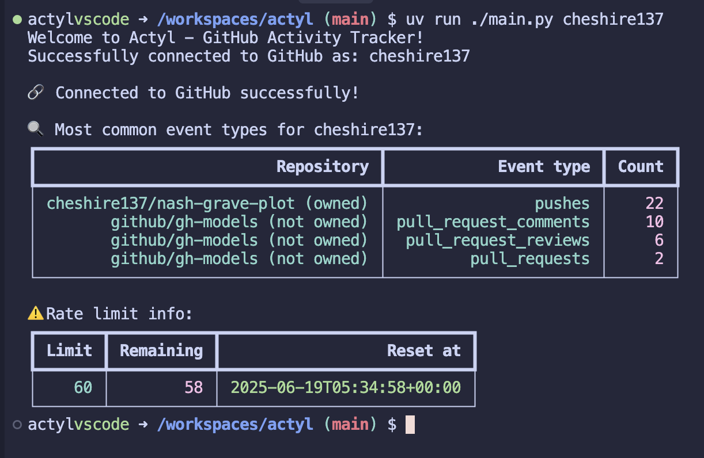

# Actyl

Provides visibility into engineering activity. It tracks development trends across projects using GitHub's API.

## Goal

- Consume GitHub's [public API for User Activity](https://docs.github.com/en/rest/activity/events?apiVersion=2022-11-28)
- Compute how active a user is in open-source, public projects.
- Track repository activity, commits, issues, and pull requests.

## Installation

1. Clone the repository:
```bash
git clone <repository-url>
cd actyl
```

2. Install dependencies using uv:
```bash
uv sync
```

3. (Optional) Set up your GitHub Personal Access Token:
   - Go to [GitHub Settings > Tokens](https://github.com/settings/tokens)
   - Create a new token with appropriate permissions (repo, user)
   - Set the environment variable:
```bash
export GITHUB_TOKEN="your_token_here"
```

## Dependencies

- [PyGithub](https://github.com/PyGithub/PyGithub) - GitHub API wrapper
- [Rich](https://github.com/Textualize/rich) - Display rich text and beautiful formatting in the terminal

## Usage

### Basic Usage

```python
from activity_tracker import ActivityTracker

with ActivityTracker(username=USERNAME) as tracker:
    print(f"Connecting as: {username}")
    
    # Get user public event activity
    user_activity = tracker.get_user_event_activity()
    print(f"User activity stats: {user_activity['stats']})
```

### Command Line Usage

Run the main application:
```bash
uv run ./main.py cheshire137
```

The output of that command should be:


## ActivityTracker Class

The `ActivityTracker` class provides an interface for GitHub activity tracking.

### Methods

#### `__init__(username: str, token: Optional[str] = None)`
Initialize the tracker with GitHub API connection.

- `username`: GitHub username that will be tracked
- `token`: GitHub personal access token (or set `GITHUB_TOKEN` env var)

#### `get_user_event_activity() -> Dict[str, Any]`
Get activity data for the user across all repositories.

Returns a dictionary containing:
- `stats`: List of repository statistics with activity counters for pushes, pull requests, issues, comments, and other events
- Each repository stat includes:
  - `name`: Repository name
  - `counter`: Activity counters for different event types
  - `owned`: Boolean indicating if the user owns the repository

#### `get_rate_limit_info() -> Dict[str, Any]`
Get current GitHub API rate limit information.

Returns rate limit details including:
- `limit`: Total API calls allowed
- `remaining`: Remaining API calls
- `reset_time`: When the rate limit resets
- `search_limit`: Search API limit
- `search_remaining`: Remaining search API calls

#### `close()`
Close the GitHub API connection.

#### Context Manager Support

The ActivityTracker supports context manager usage:
```python
with ActivityTracker(username="example") as tracker:
    activity = tracker.get_user_event_activity()
```

### Error Handling

The ActivityTracker includes comprehensive error handling:

- **Invalid Token**: Clear error message for authentication issues
- **Rate Limiting**: Handles API rate limit exceeded errors
- **Repository Access**: Graceful handling of access denied errors
- **Network Issues**: Connection error handling with retry logic

## Contributing

1. Fork the repository
2. Create a feature branch
3. Commit your changes
4. Add tests if applicable
5. Submit a pull request

## License

[MIT](https://opensource.org/license/mit)
